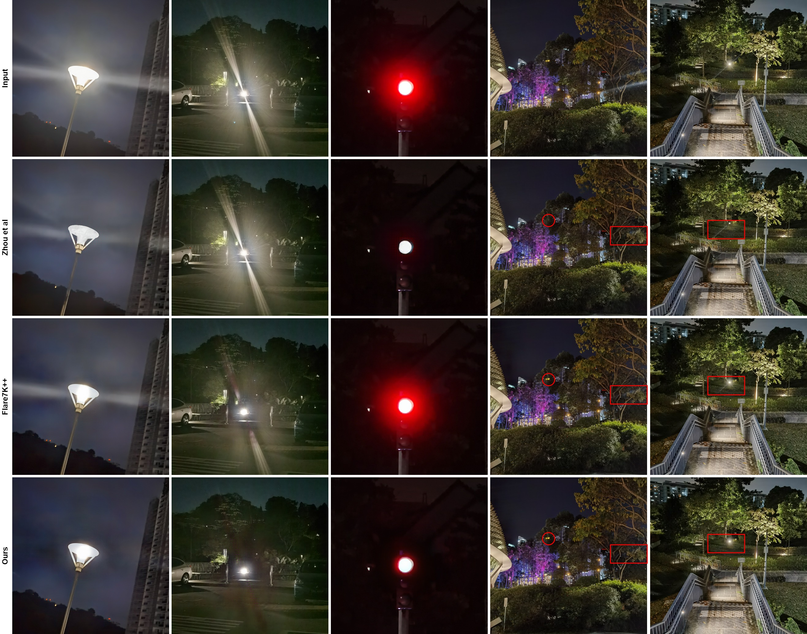

# Flare-Free Vision: Empowering Uformer with Depth Insights
Image flare is a common problem that occurs when a camera lens is pointed at a strong light source. It can manifest as ghosting, blooming, or other artifacts that can degrade the image quality. We propose a novel deep learning approach for flare removal that uses a combination of depth estimation and image restoration. We use a Dense Vision Transformer to estimate the depth of the scene. This depth map is then concatenated to the input image, which is then fed into a Uformer, a general U-shaped transformer for image restoration. Our proposed method demonstrates state-of-the-art performance on the Flare7K++ test dataset, demonstrating its effectiveness in removing flare artifacts from images. Our approach also demonstrates robustness and generalization to real-world images with various types of flare. We believe that our work opens up new possibilities for using depth information for image restoration.

<p align="center">
  
</p>

## Table of Contents
- [Flare-Free Vision: Empowering Uformer with Depth Insights](#flare-free-vision-empowering-uformer-with-depth-insights)
  - [Installation](#installation)
  - [Dataset](#dataset)
  - [Training](#training)
    - [Training Using Single GPU](#training-using-single-gpu)
    - [Training Using Multiple GPUs](#training-using-multiple-gpus)
  - [Testing](#testing)
    - [Saved Checkpoint](#saved-checkpoint)
    - [Inference](#inference)
    - [Evaluation](#evaluation)
  - [License](#license)
  - [Acknowledgement](#acknowledgement)
## Installation
1. Clone the repository
```bash
git clone https://github.com/yousefkotp/Flare-Free-Vision-Empowering-Uformer-with-Depth-Insights.git
```

2. Install the requirements
```bash
cd Flare-Free-Vision-Empowering-Uformer-with-Depth-Insights
pip install -r requirements.txt
```

3. Install BasicSR
```bash
python setup.py develop
```

4. Install pretrained [Dense Vision Transformer](https://drive.google.com/file/d/1dgcJEYYw1F8qirXhZxgNK8dWWz_8gZBD/view) for Depth Prediction and put it in `DPT` folder.


## Dataset

The dataset used in training and testing is uploaded on [Google Drive](https://drive.google.com/file/d/1rQ2ZG3HHoBOogYw_qnH3SgLlNlsQtPST/view?usp=sharing). To avoid multiple errors, follow the following structure:

```
dataset (folder)
├── README.md
├── Flare7Kpp
│   ├── Flare7K
|   |── |── Scattering_Flare
|   |── |── |── Compound_Flare
|   |── |── |── Light_source
|   |── Flare-R
|   |── |── Compound_Flare
|   |── |── Light_source
|   |── test_data
|   |── |── real
|   |── |── |── gt
|   |── |── |── input
|   |── |── |── mask
|   |── |── synthetic
|   |── |── |── gt
|   |── |── |── input
|   |── |── |── mask
|   |── val
|   |── |── gt
|   |── |── input
|   |── |── mask
|── Flickr24K
```

To unzip the dataset, run the following command:

```bash
unzip dataset.zip -d dataset
```

## Training

### Training Using Single GPU
To start training, you need to configure your training parameters in `options/uformer_flare7kpp_baseline_option.yml`. Then, run the following command:

```python
python basicsr/train.py -opt options/uformer_flare7kpp_baseline_option.yml
```

**Note:** you can start autmotaically from a checkpoint by adding `--auto_resume` to the command above.
```python
python basicsr/train.py -opt options/uformer_flare7kpp_baseline_option.yml --auto_resume
```

### Training Using Multiple GPUs
To start training using multiple GPUs, you need to configure your training parameters in `options/uformer_flare7kpp_baseline_option.yml`. Then, run the following command:

```python
CUDA_VISIBLE_DEVICES=0,1 bash scripts/dist_train.sh 2 options/uformer_flare7kpp_baseline_option.yml
```

## Testing

### Saved Checkpoint
We have uploaded our trained model on [Google Drive](https://drive.google.com/file/d/13SWmwJVaRn6tUuJX2fljbrrxQSr9xVF6/view?usp=sharing). To use it, you can download it and put it in `experiments/flare7kpp/pretrained.pth`.

### Inference
To start inference on test dataset, you can run the following command:

```python
python basicsr/inference.py --input dataset/Flare7Kpp/test_data/real/input/ --output result/real/pretrained/ --model_path experiments/flare7kpp/pretrained.pth --flare7kpp
```

### Evaluation
To evaluate the performance of the model using PSNR, SSIM, LPIPS, Glare PSNR, and Streak PSNR, you can run the following command:

```python
python evaluate.py --input result/real/pretrained/blend/ --gt dataset/Flare7Kpp/test_data/real/gt/ --mask dataset/Flare7Kpp/test_data/real/mask/
```

## License
This project is governed by the S-Lab License 1.0. If you intend to redistribute or utilize the code for non-commercial purposes, it is imperative to adhere to the terms outlined in this license

## Acknowledgement
This work borrows heavily from [Flare7K++: Mixing Synthetic and Real Datasets for Nighttime Flare Removal and Beyond](https://github.com/ykdai/Flare7K). We would like to thank the authors for their work.
